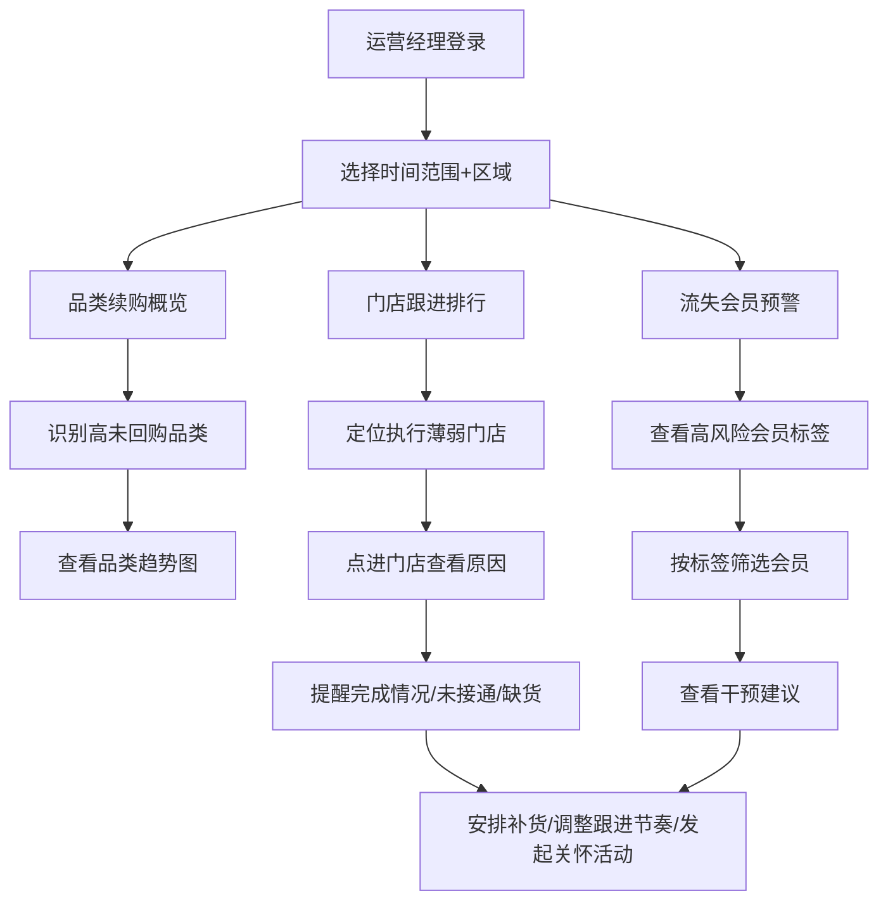

## 1. 产品概述

面向连锁药店会员运营部的续购数据看板，服务对象为负责复购率和会员留存的区域运营经理。
- 解决核心问题：运营经理缺乏事前干预工具，只能事后看销售额复盘，无法在续购周期内识别风险、安排补货和电话跟进节奏
- 产品价值：将"事后复盘"转为"事前预警+事中干预"，降低处方药会员流失率，提升品类续购转化

## 2. 核心功能

### 2.1 用户角色

| 角色 | 使用方式 | 核心权限 |
|------|----------|----------|
| 区域运营经理 | 系统登录 | 查看所辖区域品类续购数据、门店跟进排行、流失预警；导出数据 |
| 总部运营总监 | 系统登录 | 查看全区域汇总数据、跨区域对比 |

### 2.2 功能模块

1. **续购数据看板主页**：全局筛选器（时间范围+区域）+ 三大核心模块总览
2. **品类续购概览**：处方药品类续购率看板，支持品类钻取
3. **门店跟进排行**：门店续购跟进执行情况排行与详情下钻
4. **流失会员预警**：高风险会员分层标签与干预建议

### 2.3 页面详情

| 页面名称 | 模块名称 | 功能描述 |
|----------|----------|----------|
| 续购数据看板主页 | 全局筛选器 | 选择时间范围（近7天/近30天/近90天/自定义）、选择区域（华东/华南/华北等）；筛选结果联动所有模块 |
| 续购数据看板主页 | 品类续购概览 | 卡片式展示各处方药品类的预计续购人数、实际回购人数、未回购比例；点击品类展开趋势图和会员分布 |
| 续购数据看板主页 | 门店跟进排行 | 表格排行展示门店的提醒完成率、续购成功率；点击门店展开详情：提醒是否按时完成、多次未接通会员列表、缺货导致续购失败的药品列表 |
| 续购数据看板主页 | 流失会员预警 | 高风险会员列表，分层标签（连续三次未回购/处方可能过期/只在线下买过无法触达）；支持按标签筛选；每条会员显示干预建议（补货/电话跟进/会员关怀活动） |

## 3. 核心流程

运营经理登录后，选择时间范围和区域，系统加载对应数据。运营经理首先在"品类续购概览"中识别未回购比例最高的品类，然后在"门店跟进排行"中定位执行不到位的门店，点进门店查看具体原因（未接通、缺货等），最后在"流失会员预警"中查看高风险会员的分层标签，据此安排补货、调整电话跟进节奏或发起会员关怀活动。

## 4. 用户界面设计

### 4.1 设计风格

- 主色调：深青色(#0F766E)作为品牌色，搭配暖琥珀色(#D97706)作为警示/强调色
- 中性色：石板灰(Slate)系列，营造专业医疗数据感
- 按钮风格：圆角8px，主按钮填充色、次按钮描边
- 字体：思源黑体/Noto Sans SC为主，数字使用等宽字体JetBrains Mono
- 布局风格：左侧固定导航栏 + 顶部筛选条 + 主体三栏卡片式布局
- 图标风格：线性图标，统一2px描边

### 4.2 页面设计概览

| 页面名称 | 模块名称 | UI元素 |
|----------|----------|--------|
| 看板主页 | 全局筛选器 | 顶部固定条，包含日期选择器、区域下拉选择器、刷新按钮 |
| 看板主页 | 品类续购概览 | 横向排列品类卡片，每张卡片显示品类名称、预计续购/实际回购人数、环形进度图、未回购比例百分比；点击展开模态面板显示折线趋势图 |
| 看板主页 | 门店跟进排行 | 表格组件，列含排名、门店名称、提醒完成率（进度条）、续购成功率（进度条）；行可展开为子面板显示提醒详情列表、未接通会员、缺货药品 |
| 看板主页 | 流失会员预警 | 带标签筛选的会员列表；每行显示会员姓名、手机号掩码、品类、风险标签（彩色标签）、干预建议按钮；标签颜色区分紧急程度 |

### 4.3 响应式设计

- 桌面端优先（1440px+），确保数据密度和专业感
- 平板端（1024px-1440px）卡片从三列变两列
- 移动端（<1024px）卡片单列堆叠，表格转为可滑动

### 4.4 3D场景指引

不适用
