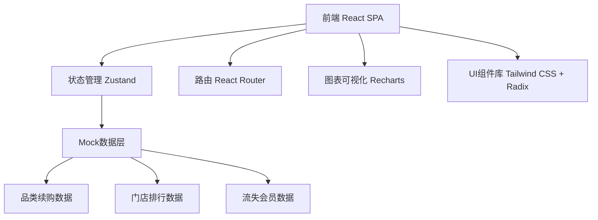
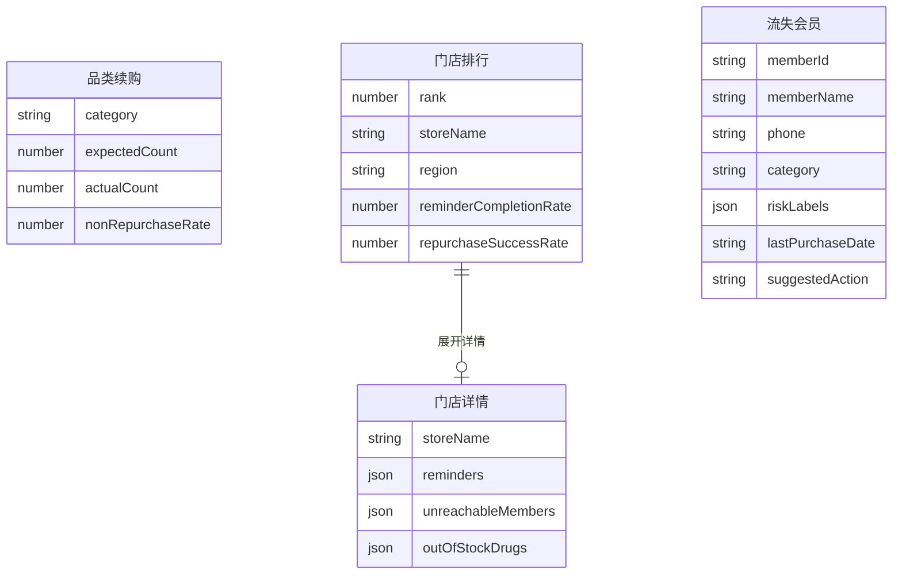

## 1. 架构设计



## 2. 技术说明

- 前端：React@18 + TypeScript + Tailwind CSS@3 + Vite
- 初始化工具：vite-init
- 后端：无（使用Mock数据模拟）
- 数据库：无（前端Mock数据）
- 状态管理：Zustand
- 图表库：Recharts
- 图标库：lucide-react
- UI基础：Radix UI + Tailwind CSS

## 3. 路由定义

| 路由 | 用途 |
|------|------|
| / | 看板主页，包含三大核心模块 |

## 4. API定义

无后端API，使用前端Mock数据。数据结构定义如下：

```typescript
interface CategoryRepurchase {
  category: string
  expectedCount: number
  actualCount: number
  nonRepurchaseRate: number
  trend: { date: string; expected: number; actual: number }[]
}

interface StoreRanking {
  rank: number
  storeName: string
  region: string
  reminderCompletionRate: number
  repurchaseSuccessRate: number
  details: StoreDetail
}

interface StoreDetail {
  reminders: { memberName: string; dueDate: string; completed: boolean; completedDate?: string }[]
  unreachableMembers: { memberName: string; phone: string; attempts: number; lastAttempt: string }[]
  outOfStockDrugs: { drugName: string; affectedMembers: number; restockDate?: string }[]
}

interface ChurnMember {
  memberId: string
  memberName: string
  phone: string
  category: string
  riskLabels: string[]
  lastPurchaseDate: string
  suggestedAction: string
}

type RiskLabel = '连续三次未回购' | '处方可能过期' | '只在线下买过无法触达'
```

## 5. 服务端架构图

不适用（无后端）

## 6. 数据模型

### 6.1 数据模型定义



### 6.2 数据定义语言

不适用（无数据库，使用前端Mock数据）
